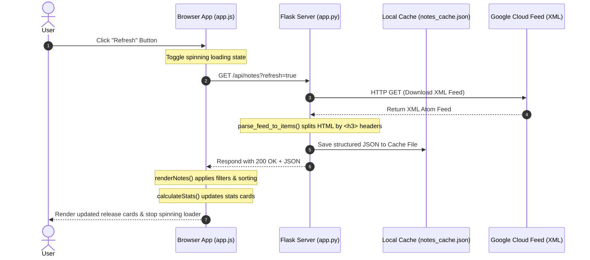

# BigQuery Release Notes Tracker

A modern, high-end web application built with **Python Flask** and vanilla **HTML5, CSS3, and JavaScript**. This app parses Google Cloud's official BigQuery Atom release feed, separates date blocks into individual searchable cards, caches results locally, and supports one-click Twitter/X posting with automatic character truncation.

---

## 🛠️ Main Features

*   **Granular Parsing**: The backend splits Google Cloud’s unified date updates by their headers (`<h3>` tags) into distinct release cards (e.g. classifying updates as `Feature`, `Issue`, `Changed`, or `Deprecation`).
*   **Performance Cache**: Implements local caching (`notes_cache.json`) to load notes instantaneously on page load and avoid hitting Google's rate limits on every refresh.
*   **Rich Dark Theme**: Designed with a custom slate dark-theme color palette featuring statistics indicators, glassmorphism overlays, and micro-interactions.
*   **Smart Tweet Composer**: Formats release summaries into ready-to-share tweets. It automatically truncates the description on word boundaries to respect Twitter's 280-character limit, factoring in Twitter's standard 23-character wrapping length for external URLs.

---

## 💻 Tech Stack

*   **Backend**: Python 3.14+, Flask, `feedparser` (Atom/RSS parsing), `beautifulsoup4` (HTML restructuring and text extraction), `requests`.
*   **Frontend**: Vanilla HTML5, Vanilla CSS3 (Custom variables, responsive grids), Vanilla JS (ES6 fetch, DOM bindings).
*   **Repository**: Git, configured with a comprehensive `.gitignore` for Python virtual environments and caches.

---

## 🚀 Getting Started

### Prerequisites
*   Python 3.12 or higher installed on your system.

### Installation & Run

1.  **Clone the Repository**:
    ```bash
    git clone https://github.com/julianvlz777-ai/Julian-event-talks-app.git
    cd Julian-event-talks-app
    ```

2.  **Create and Activate Virtual Environment**:
    *   **On Windows (PowerShell)**:
        ```powershell
        python -m venv venv
        .\venv\Scripts\Activate.ps1
        ```
    *   **On macOS/Linux (Bash)**:
        ```bash
        python -m venv venv
        source venv/bin/activate
        ```

3.  **Install Dependencies**:
    ```bash
    pip install flask requests feedparser beautifulsoup4
    ```

4.  **Run the Server**:
    ```bash
    python app.py
    ```

5.  **Open in Browser**:
    Visit [http://127.0.0.1:5000](http://127.0.0.1:5000) in your web browser.

---

## 📂 Project Structure

```
├── app.py                  # Flask backend, XML parser, and JSON caching engine
├── notes_cache.json        # Auto-generated local cache of parsed notes
├── templates/
│   └── index.html          # Semantic HTML layout and tweet modal dialog
├── static/
│   ├── css/
│   │   └── style.css       # Layout variables, animations, dark theme, and grid rules
│   └── js/
│       └── app.js          # API calls, state controller, client filtering, and tweet compiler
├── .gitignore              # Git ignore rules for virtual environments, caches, and IDE files
└── README.md               # Project documentation
```

---

## 🔄 How It Works: Request-Response Flow

Below is the execution flow when a user clicks the **Refresh** button to update the release notes:



1.  **Frontend trigger**: The client clicks the **Refresh** button. `app.js` updates the button state to a spinning loader.
2.  **API request**: The client requests `/api/notes?refresh=true`.
3.  **Backend Fetch & Parse**: The Flask server downloads the Atom feed XML from Google Cloud. `BeautifulSoup` splits the text by `<h3>` headings.
4.  **Serialization**: The server saves the parsed items to `notes_cache.json` and returns the structured JSON to the browser.
5.  **State Render**: The client parses the JSON, calculates statistics, applies active searches and filters, and renders the card list.

---

## 🐦 Smart Twitter Truncation Engine

The Twitter composer uses a custom Javascript logic to keep the draft under 280 characters without truncating midway through a word:

*   **URL Policy**: Twitter converts all URLs into short `t.co` links which always count as exactly **23 characters**.
*   **Calculation**:
    ```javascript
    // Max capacity (280) minus fixed header, footer labels, and the 23-char URL wrapper
    const availableSpace = 280 - headerLength - (16 + 23 + 15);
    ```
*   **Ellipsis wrapping**: If the release note content is longer than the `availableSpace`, it truncates the string to the maximum length allowed, backtracks to the last whitespace character to keep the final word intact, and appends `...`.
